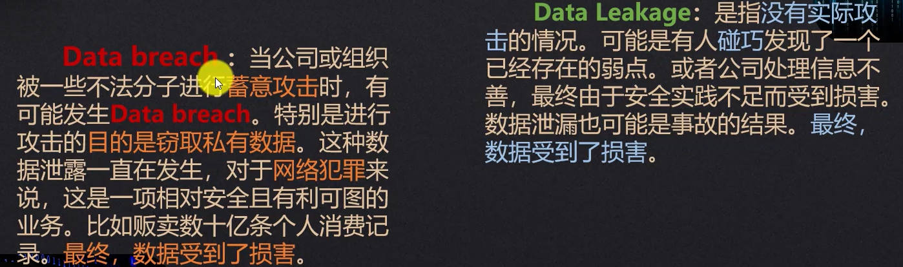

+++
title = "AI 安全学习 Week 1 · D2：机器学习任务、特征、标签与数据划分"
date = 2026-08-12T12:02:00+08:00
draft = false
description = "梳理监督学习与无监督学习、样本特征与标签，并从安全检测视角记录数据划分和数据泄漏问题。"
categories = ["AI安全"]
tags = ["学习", "AI安全"]
+++
## 预习

机器学习分为监督学习、无监督学习、强化学习

监督学习：回归算法（用函数拟合数据）、分类算法（二分类）

无监督学习：无标签，自发的在数据中找到某种结构模式，例如聚类算法、异常检测、降维

## 正式讲课

### 第一单元：机器学习任务到底在学习什么

传统规则系统：人工总结规律 → 编写判断条件 → 输出结果

机器学习系统：收集历史数据 → 算法学习规律 → 对新数据预测

**机器学习适合进行概率判断，但不适合替代不可绕过的权限控制。**

分类回答“属于哪一类”，回归回答“数值大约是多少”

无监督模型只能提供异常线索，通常仍需要业务规则、人工复核或后续有监督模型确认。

> 当我们使用机器学习模型检测恶意输入、异常工具调用或敏感信息泄露时，模型究竟根据什么数据学习，又怎样证明它对新攻击有效？

> 机器学习**通过历史数据**学习**输入与输出之间的统计关系**，而不是完全依赖人工编写规则。
>
> 监督学习使用**带标签**数据，主要解决**分类和回归**问题，**分类预测离散类别，回归预测连续数值。**
>
> 无监督学习**不依赖标签**，主要**寻找聚类结构、低维表示或异常样本**。
>
> 安全系统中，模型适合提供风险判断，但权限、审批和执行边界仍必须由确定性程序控制。

**问题：**

请判断下面三个任务分别属于哪一种类型，并简单说明原因：

```text
任务 A：根据已标注的历史邮件，预测新邮件属于“正常”还是“钓鱼”。
任务 B：根据过去的模型调用记录，预测下一次调用会消耗多少 Token。
任务 C：没有任何攻击标签，根据工具调用模式找出明显不同于大多数行为的记录。
```

我的回答：

任务 A：监督学习里面的分类，判断“正常”还是“钓鱼”

任务 B：监督学习里面的回归，预测数值

原因：历史调用记录中已经有实际 Token 消耗量作为标签，模型学习调用特征与连续数值之间的关系

任务 C：无监督学习里面的异常检测

原因：只根据行为分布找异常点

### 第二单元：样本、特征与标签

[https://developers.google.com/machine-learning/crash-course/overfitting/labels?hl=zh-cn](https://developers.google.com/machine-learning/crash-course/overfitting/labels?hl=zh-cn)

训练样本数量与可训练参数之间没有通用的固定倍数规则；所需数据量还取决于任务复杂度、数据质量、模型先验与正则化等因素。

数据质量：高质量的数据集有助于模型实现其目标。质量较低的数据集会妨碍模型实现其目标。

#### 样本

**样本（Sample）**是机器学习任务中的一个独立观测对象。它不一定对应一个人，也不一定对应一份文件，而是由任务定义决定。

假设我们希望训练一个模型，判断 Agent 的一次工具调用是否越权，那么**每一次工具调用就可以视为一个样本**。若同一个 Agent 连续调用了五次工具，这通常对应五条样本，而不是一条样本。

#### 特征

**特征（Feature）**是模型的输入变量。它们用于描述样本，但特征必须满足一个关键条件：模型实际进行预测的那个时刻，这项信息必须已经存在。

还是以前面的工具调用为例，用户角色、工具名称、调用时间、参数长度和目标路径类型，都可能作为特征，因为这些信息在工具真正执行前已经能够获得。

特征可以分为原始特征和派生特征。**原始特征直接来自系统日志**，例如工具名称和参数文本；**派生特征则由原始信息计算得到**，例如参数字符数、路径深度、是否访问外部域名、过去十分钟调用次数。

#### 标签

**标签（Label）**是监督学习中的目标答案。

标签应由可信的审核规则、人工审计结果或可靠事件记录产生。**不能简单地把模型自己的判断再当作真实标签**，否则模型可能只是在学习旧模型的错误。

| request_id | user_role | tool_name | hour | argument_length | external_target | audit_label |
| --- | --- | --- | --- | --- | --- | --- |
| R001 | employee | search_docs | 10 | 28 | 0 | 0 |
| R002 | employee | read_file | 23 | 46 | 0 | 1 |
| R003 | admin | update_record | 14 | 31 | 0 | 0 |
| R004 | employee | send_email | 11 | 125 | 1 | 1 |
| R005 | auditor | read_log | 16 | 20 | 0 | 0 |

将其写成机器学习形式，可以表示为：

$$
X= \begin{bmatrix} x_{11} & x_{12} & \cdots & x_{1p}\\ x_{21} & x_{22} & \cdots & x_{2p}\\ \vdots & \vdots & \ddots & \vdots\\ x_{n1} & x_{n2} & \cdots & x_{np} \end{bmatrix}, \qquad y= \begin{bmatrix} y_1\\ y_2\\ \vdots\\ y_n \end{bmatrix}
$$

其中，n 表示样本数量，p 表示特征数量，X 是特征矩阵，y 是标签向量。

对于上面的数据：

```text
X：用户角色、工具名称、小时、参数长度、是否访问外部目标
y：是否越权
```

模型训练的目标，就是根据 X 学习一个函数，尽可能准确地预测 y。

#### 文本特征工程

对于提示词、邮件、PDF 内容和工具参数等文本数据，模型不能直接处理原始中文句子，通常需要把文本转换成数值表示。

TF-IDF / Embedding

#### 标签质量

数据设计先于模型选择。标签定义不清、样本不独立或特征泄漏时，换更复杂的模型通常不能解决根本问题。

> 样本是任务中的独立观测单位
>
> 特征是模型预测时能够获得的输入信息
>
> 标签是监督学习需要预测的目标结果。
>
> 样本标识通常不作为特征，预测后才出现的审计结果、阻断状态或损失金额不能用于预测前模型，否则会产生目标泄漏。
>
> 文本、类别和时间等原始数据最终需要转换成可计算的数值表示，而标签的一致性和可信度决定模型结果能否被解释。

**问题：**

考虑下面的 Agent 邮件外发风险数据：

| 字段 | 含义 |
| --- | --- |
| `message_id` | 邮件调用编号 |
| `user_role` | 发件人的角色 |
| `recipient_domain` | 收件人域名 |
| `attachment_count` | 附件数量 |
| `contains_sensitive_data` | 正文或附件是否包含敏感信息 |
| `security_blocked` | 安全系统最终是否阻断 |
| `manual_audit_label` | 人工审核后确认是否违规 |
| `actual_loss_amount` | 邮件发出后造成的实际损失金额 |

任务是在邮件真正发出之前预测该次外发是否违规。

请回答：

```text
1. 一条样本是什么？
2. 哪个字段适合作为标签？
3. 哪些字段可以作为候选特征？
4. 哪些字段不应作为特征，并说明原因？
```

我的回答：

1.  一条样本是每一条即将外发的邮件
2.  标签：manual_audit_label
3.  候选特征：recipient_domain、attachment_count、contains_sensitive_data、 x

`message_id`、`security_blocked` 和 `manual_audit_label` 都不应作为特征。

`message_id` 只是用于定位和追踪邮件的唯一标识，通常没有可泛化的业务含义

`security_blocked` 是安全系统完成判断后产生的结果，在邮件发送前风险模型进行预测时不应提前知道

`manual_audit_label` 本身就是标签，如果把答案同时放进输入，模型会直接看到正确结果，形成最严重的目标泄漏

`actual_loss_amount` 同样发生在邮件发出后，也不能用于发送前预测。机器学习特征必须是在实际预测时已经可获得的信息，否则离线评估会虚高，但模型部署后无法复现这种效果。

**答案：user_role、recipient_domain、attachment_count， 以及发送前可计算的 contains_sensitive_data**

> 候选特征：有可能用于模型训练的全部特征

4.  actual_loss_amount不应该作为特征，因为在邮件真正发出之前，该项特征并未产生，如果把它作为特征，就利用了预测之后才产生的信息

### 第三单元：训练集、验证集与测试集

Google 的中文机器学习课程也指出，训练集用于学习模型参数，验证集用于开发期间选择模型和调整配置，测试集只用于最终确认；若反复根据测试集结果修改模型，模型会逐渐适应测试集，导致测试结果失去独立性。

机器学习的目标不是把已有数据解释得很好，而是对未来未见数据进行可靠预测。检验其**泛化能力（Generalization）**，即对新数据的处理能力。

模型训练过程中往往存在许多需要人为选择的配置，例如模型类型、特征组合、树的深度、正则化强度、分类阈值和训练轮数。这些设置通常称为**超参数（Hyperparameters）**

**训练集（Training Set）**用于学习模型内部参数。

验证集的作用是模拟未见数据，帮助我们比较不同方案。

**测试集（Test Set）**用于在开发基本完成后，进行最终独立评估。

若模型没有直接在测试集上训练，开发者的决策利用了测试信息，这叫**测试集污染（Test Set Contamination）**

****

**模型参数**是模型从训练数据中自动学到的内容。例如逻辑回归的权重、神经网络中的权重和偏置

**超参数**是训练前或开发过程中人为设置的配置，例如学习率、树的最大深度、隐藏层大小、正则化强度和分类阈值

对于 AI 安全检测任务，数据独立性尤其重要，因为重复攻击模板、相同用户或未来信息都可能制造虚假的高性能

**问题：**

某团队训练一个 Prompt Injection 检测器，过程如下：

```text
1. 使用训练集训练模型。
2. 在测试集上比较五个模型。
3. 选择测试集 F1 最高的模型。
4. 根据测试集结果调整分类阈值。
5. 最后继续在同一个测试集上报告最终 F1。
```

请回答：

```text
1. 这个流程的主要问题是什么？
2. 测试集在这个流程中实际上承担了什么角色？
3. 正确流程应如何调整？
```

我的回答：

1.不能根据测试集结果调整分类阈值

2.验证集的角色

3.将数据集分为训练集、验证集、测试集。使用训练集训练模型；在验证集上比较五个模型；选择验证集 F1 最高的模型；根据验证集结果调整分类阈值；最后继续在测试集上报告最终 F1。

### 第四单元：数据泄漏、随机切分与时间切分



**数据泄漏（Data Leakage）**是指模型在训练、调参或评估过程中，获得了真实部署时不应该知道的信息。它不一定表现为“把标签列直接放进特征”，也可能通过全量数据预处理、相似样本重复、同一用户跨集合或未来信息混入训练等方式发生。

#### 第一类泄漏：目标信息直接或间接进入特征——目标泄漏（Target Leakage）

例如：

```text
预测目标：
邮件是否违规

不合理特征：
security_blocked
incident_ticket_created
actual_loss_amount
```

这些字段虽然名称不是“违规标签”，却通常在安全系统完成判断或事故发生后才生成，与标签高度相关。模型可能轻易得到很高分，但在邮件真正发送前，这些信息尚不存在。

#### 第二类泄漏：先处理全部数据，再进行划分

假设我们需要对数值特征进行标准化。标准化通常需要计算均值和标准差：

$$
x'=\frac{x-\mu}{\sigma}
$$

如果先使用全部数据计算，然后再划分训练集和测试集，那么测试集的统计分布已经参与了训练数据的转换。虽然模型没有直接看到测试标签，但它仍然获得了测试数据的信息。

同样的原则适用于缺失值填充、特征选择、文本词表、TF-IDF、降维和异常值阈值。只要某个步骤需要从数据中“学习”统计量，就必须只在训练数据上执行 `fit`，再对验证集和测试集执行 `transform`。

#### 第三类泄漏：重复样本和关联实体跨集合

安全数据往往不是彼此独立的。一封钓鱼邮件可能有十个只修改了收件人名称的副本，一条 Prompt Injection 模板可能被改写成几十个近似版本，同一用户也可能在几分钟内产生大量相似工具调用。

若直接随机切分，这些高度相似的数据可能分别进入训练集和测试集。模型看似在预测新样本，实际上只是识别已经见过的模板或用户行为。

这时应该按照用户、会话、文档、域名或攻击家族进行**分组切分（Group Split）**，确保同一组只属于一个集合。

#### 第四类泄漏：未来时间进入过去模型——时间泄漏（Temporal Leakage）

假设我们在 2026 年 1 月部署一个工具调用风险模型，那么训练时只能使用 2026 年 1 月之前可以获得的数据。若训练集中混入 3 月和 4 月的攻击模式，再用模型测试 2 月数据，就等于使用未来知识预测过去。

#### 随机切分

**随机切分（Random Split）**会将样本打乱后按照一定比例分配给训练集、验证集和测试集。它适合样本之间相对独立、数据分布稳定，并且实际部署时的新样本与历史样本来自相似分布的场景。

例如，对互相独立的静态图片进行基础分类时，随机切分通常是合理起点。但即使使用随机切分，也要检查重复图片、同一对象的多张照片和类别比例。

安全日志**通常具有明显的时间、用户、会话和攻击家族关联**，因此随机切分容易高估模型效果。

它可能回答的是：模型能否识别从同一历史分布中随机抽取的其他样本？

但真实系统更关心：模型能否识别未来出现的新攻击、新用户和新表达方式？

| 切分方式 | 适用场景 | 主要防止的问题 | AI 安全示例 |
| --- | --- | --- | --- |
| 随机切分 | 样本相对独立且分布稳定 | 普通训练测试混用 | 独立人工构造的基础分类样本 |
| 分组切分 | **同一实体产生多条关联记录** | 同用户、同会话、同模板跨集合 | 按攻击模板家族或用户切分 |
| 时间切分 | **使用历史预测未来** | 未来信息进入训练 | 用过去日志预测未来越权调用 |

**问题：**

某团队收集了两年的 Agent 工具调用日志，希望使用历史数据预测未来的越权调用。数据中同一用户会产生多条调用记录，模型训练前还需要对数值特征进行标准化。

团队采取了以下流程：

```text
1. 在全部两年数据上计算均值和标准差。
2. 对全部数据完成标准化。
3. 随机打乱所有记录。
4. 按 70% / 15% / 15% 划分训练、验证和测试集。
5. 使用验证集调参，测试集最终评估。
```

请回答：

```text
1. 这个流程中至少存在两种什么风险？
2. 为什么普通随机切分不一定适合这个任务？
3. 更合理的数据处理和切分顺序是什么？
```

我的回答：

1.  对全部数据进行计算均值和标注差，模型得到了测试集数据的信息；随机打乱所有记录，会导致时间泄露，用未来数据预测过去，以及重复样本分别进入训练集和测试集。
2.  因为该日志数据不是样本之间相对独立、数据分布稳定、且没有明显时间顺序的数据集
3.  应该先进行分组切分，同一用户产生的多条相似调用记录分为一组，再进行时间切分，使用历史信息预测未来；之后对训练集数据计算均值和标准差用以训练。

“同一用户产生多条记录”不等于“重复样本”。这些记录可能是不同时间、不同工具和不同参数下的独立调用，只是彼此存在关联。随机切分会使同一用户同时出现在训练集和测试集，模型可能记住用户身份或稳定行为模式，从而高估泛化能力；这属于**实体关联泄漏风险**或评估偏乐观，而不一定是字面意义上的重复数据。

标答3：

```text
明确部署目标
    ↓
按时间排序并确定训练、验证、测试时间边界
    ↓
根据评估目标决定是否隔离用户、会话或攻击家族
    ↓
检查同一事件、重复记录和未来特征是否跨集合
    ↓
只在训练集上拟合均值、标准差和其他预处理器
    ↓
使用训练集得到的预处理规则转换验证集和测试集
    ↓
训练集训练，验证集调参，冻结配置
    ↓
测试集最终评估
```

该流程同时存在全量标准化导致的预处理泄漏，以及随机打乱导致的时间泄漏；同一用户的多条关联记录跨集合还可能造成评估偏乐观。更合理的方案是先明确评估目标，按时间构建训练、验证和测试区间，必要时同时隔离用户或会话，然后仅在训练集上拟合标准化器，并将同一转换规则应用于验证集和测试集。

> “先进行分组切分，再进行时间切分”不是任何情况下都适用。正确方法取决于实验到底要评估什么。
>
> 如果系统上线后要预测**已有用户未来的调用行为**，同一用户可以同时出现在历史训练集和未来测试集，但必须严格按照时间划分，并且所有用户统计特征只能使用预测时刻之前的数据。
>
> 如果目标是判断模型能否处理**从未见过的新用户**，则应采用按用户分组的切分，使同一用户不能跨越训练集和测试集；同时还要尽可能满足训练数据早于测试数据的时间约束。这实际上是联合执行实体隔离与时间隔离，而不是简单机械地先后调用两个切分函数。

## 实践：小型数据划分代码实验
