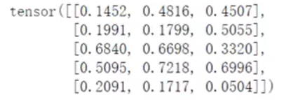

+++
title = "AI 安全学习 Week 1 · D4：PyTorch、前向传播与反向传播"
date = 2026-08-12T12:04:00+08:00
draft = false
description = "从 Tensor、nn.Module 和线性层出发，记录 PyTorch 中前向传播、自动求导、参数更新与模型评估的完整链路。"
categories = ["AI安全"]
tags = ["学习", "AI安全"]
+++
## 回顾与预习

### 回顾

前三天完成的是“机器学习原理层”：

-   D1：AI Agent 安全系统由哪些组件构成；
-   D2：数据如何划分，错误评估为什么会产生虚假安全结论；
-   D3：损失函数、梯度下降、反向传播、过拟合和正则化。

D4 转入“深度学习工程实现层”。今天要回答的核心问题是：

> D3 中讲过的前向传播、损失计算、反向传播和参数更新，在 PyTorch 中究竟由哪些对象、函数和数据结构实现？

### 预习



Tensor 是张量；矩阵只是二维 Tensor，张量还可以是标量、向量或更高维数组。

梯度值：`x = torch.randn(3, 4, requires_grad=True)`

反向传播如果不清零梯度会累加

## 正式讲课

### 第一单元：Tensor 是什么

#### Tensor 核心定义

Tensor 通常翻译为**张量**。在工程上，可以把它理解为：带有**形状、数据类型、计算设备和梯度信息**的多维数组。

“张量”这个名字看起来抽象，但在当前阶段不需要从微分几何理解。对深度学习工程而言：

> 标量：0 维 Tensor
>
> 向量：1 维 Tensor
>
> 矩阵：2 维 Tensor
>
> 更高维数据：3 维及以上 Tensor

```python
import torch

scalar = torch.tensor(3.0)

vector = torch.tensor([1.0, 2.0, 3.0])

matrix = torch.tensor([
    [1.0, 2.0],
    [3.0, 4.0],
])

batch = torch.tensor([
    [[1.0, 2.0], [3.0, 4.0]],
    [[5.0, 6.0], [7.0, 8.0]],
])

print(scalar.shape)   # torch.Size([])
print(vector.shape)   # torch.Size([3])
print(matrix.shape)   # torch.Size([2, 2])
print(batch.shape)    # torch.Size([2, 2, 2])
```

#### Shape：数据形状

`unsqueeze()` 做了什么

```python
labels = torch.tensor([0.0, 1.0, 0.0])
print(labels.shape)
# torch.Size([3])

labels = labels.unsqueeze(1)
print(labels.shape)
# torch.Size([3, 1])
```

它没有增加样本，只是增加了一个长度为 1 的维度。可以理解为：

```text
原来：
[0, 1, 0]

调整后：
[[0],
 [1],
 [0]]
```

#### Dtype：数据类型

Tensor 不只保存数值，还保存数值的类型。

常见类型包括：

| PyTorch 类型 | 含义 | 常见用途 |
| --- | --- | --- |
| `torch.float32` | 32 位浮点数 | **模型输入、权重、梯度** |
| `torch.float64` | 64 位浮点数 | 高精度数值计算 |
| `torch.int64` | 64 位整数 | 分类标签、索引、Token ID |
| `torch.bool` | 布尔值 | Mask、逻辑筛选 |
| `torch.float16` | 16 位浮点数 | GPU 混合精度训练 |

dtype为什么重要：

> BCEWithLogitsLoss：标签通常是 float32，例如 0.0、1.0
>
> CrossEntropyLoss：标签通常是 int64，例如 0、1、2

损失函数的计算不仅需要看标签数值，还对标签语义和数据类型有要求

#### Device：数据存放设备

关键原则：参加同一次计算的 Tensor 和模型参数必须位于兼容的设备上。

官方 `nn.Module` 文档指出，将模型移动到 GPU 会改变参数对象，因此通常应先把模型移动到目标设备，再创建优化器。

#### `requires_grad`：是否追踪梯度

创建 Tensor 时可以指定：

```python
w = torch.tensor(2.0,requires_grad=True,)
```

这表示：后续使用 `w` 参与的可微运算，需要由 PyTorch 记录，以便反向传播时计算损失对 `w` 的梯度。

> PyTorch 的 Autograd（自动微分）会记录产生 Tensor 的操作，并在反向传播时执行反向模式自动微分；这是神经网络反向传播的核心机制。

#### 数据 Tensor 与参数 Tensor 的区别

在模型训练中，不是所有的 Tensor 都需要计算梯度

输入数据、标签通常不需要梯度；模型参数需要梯度，因为训练要更新权重

标准训练过程中的方向是：

```text
输入 x：固定
标签 y：固定
模型参数 θ：需要梯度
损失 loss：由 x、y 和 θ 计算
反向传播：计算 ∂loss/∂θ
优化器：更新 θ
```

#### Tensor 错误

1.  标签形状广播错误
2.  标签类型错误： 将多分类标签错误转换成浮点向量，或者将 BCE 标签保留为不兼容的整数格式，可能导致损失函数输入语义不正确。
3.  Device 不一致： 如果数据、模型或新创建的 Mask 不在同一设备上，训练会中断。更隐蔽的问题是为了修复错误而随意把部分计算移回 CPU，造成性能测量失真。
4.  梯度错误
5.  维度语义混淆： 若错误地把序列维和特征维交换，程序有时仍能运行，但模型学习的关系已经改变。

#### 一个完整的 Tensor 数据流示例

```python
import torch

# 2 条样本，每条样本 3 个特征
features = torch.tensor(
    [
        [0.2, 1.1, -0.4],
        [0.8, 0.3, 0.5],
    ],
    dtype=torch.float32,
)

# 二分类标签
labels = torch.tensor(
    [
        [0.0],
        [1.0],
    ],
    dtype=torch.float32,
)

print("features shape:", features.shape)
print("labels shape:", labels.shape)
print("features dtype:", features.dtype)
print("labels dtype:", labels.dtype)
print("features device:", features.device)
print("requires_grad:", features.requires_grad)

输出：
features shape: torch.Size([2, 3])
labels shape: torch.Size([2, 1])
features dtype: torch.float32
labels dtype: torch.float32
features device: cpu
requires_grad: False
```

#### 必须掌握的核心代码

```python
tensor.shape
tensor.dtype
tensor.device

tensor.to(device)
tensor.float()
tensor.long()

tensor.unsqueeze(dim)
tensor.squeeze(dim)

requires_grad=True
loss.backward()
tensor.grad
```

问题：

1.  有 64 条安全日志，每条日志包含 25 个特征。输入 Tensor 的合理形状是什么？每个维度分别表示什么？

2.  模型输出：logits.shape == torch.Size([64, 1])
    标签为：labels.shape == torch.Size([64])
    使用 BCEWithLogitsLoss 前，应该如何调整标签形状？
3.  下面哪些对象通常需要 requires_grad=True？
    A. 输入特征
    B. 真实标签
    C. 模型权重
    D. 数据集中的样本编号
4.  执行：loss.backward()，之后，模型参数是否已经完成更新？说明下一步还需要执行什么。

回答：

1.  形状为 torch.Size([64, 25])，第一个维度代表64 条样本，第二个代表每条样本有25 个特征
2.  使用 labels.unsqueeze(1)，调整后的形状为 torch.Size([64, 1])
3.  C
4.  没有，反向传播只是计算梯度，下一步执行 optimizer.step()之后，参数才会更新
    完整训练顺序：

```python
optimizer.zero_grad()  # 清除上一轮累积梯度
logits = model(x)      # 前向传播
loss = loss_fn(logits, y)
loss.backward()        # 计算当前损失对参数的梯度
optimizer.step()       # 根据梯度更新参数
```

### 第二单元：`nn.Module` 与二分类神经网络

上一单元解决了“数据如何用 Tensor 表示”。现在进入模型部分：

```python
输入 Tensor
   ↓
nn.Module
   ↓
Linear 线性层
   ↓
激活函数
   ↓
Linear 输出层
   ↓
Logit
```

#### nn.Module

`nn.Module` 是 PyTorch 中所有神经网络模型和网络层的基础类。它主要负责三件事：

1.  管理模型中可学习的参数；
2.  定义输入如何经过模型得到输出；
3.  提供训练、评估、保存、加载和设备迁移等统一接口。

**一个能够自动登记参数的、可组合的计算模块。**

#### 最小二分类模型

```python
import torch
from torch import nn

class BinaryClassifier(nn.Module):
    def __init__(
        self,
        input_dim: int = 25,
        hidden_dim: int = 16,
    ) -> None:
        super().__init__()

        self.hidden = nn.Linear(
            in_features=input_dim,
            out_features=hidden_dim,
        )
        self.activation = nn.ReLU()
        self.output = nn.Linear(
            in_features=hidden_dim,
            out_features=1,
        )

    def forward(self, x: torch.Tensor) -> torch.Tensor:
        hidden = self.hidden(x)
        hidden = self.activation(hidden)
        logits = self.output(hidden)
        return logits
```

##### `__init__()` 的职责

`__init__()` 用于声明模型有哪些组件和参数，例如：

```python
self.hidden = nn.Linear(25, 16)  # 隐藏层
self.activation = nn.ReLU()    # 激活函数
self.output = nn.Linear(16, 1)   # 输出
```

通常负责定义有什么层，而不执行完整计算。

当执行：

```python
self.hidden = nn.Linear(25, 16)
```

PyTorch 会创建两类可训练参数：

```text
weight：权重矩阵
bias：偏置向量
```

对于：

```python
nn.Linear(25, 16)
```

参数形状分别是：

```python
weight.shape = [16, 25]
bias.shape   = [16]
```

这里经常出现疑问：输入明明是 `[64, 25]`，为什么权重不是 `[25, 16]`？

PyTorch 在线性层内部按照类似下面的形式计算：$Y=XW^\mathsf{T}+b$

形状对应为：

```text
X：     [64, 25]
W：     [16, 25]
Wᵀ：    [25, 16]

X @ Wᵀ：[64, 25] @ [25, 16] → [64, 16]
```

因此 `nn.Linear` 的权重存储形状是：

```text
[out_features, in_features]
```

##### 调用 `super().__init__()`

这行代码初始化父类 `nn.Module` 的内部机制，如果遗漏它，结果可能是模型创建时报错，或者模型参数不能被正确管理。

```python
class MyModel(nn.Module):
    def __init__(self):
        super().__init__()
```

##### forward()

`forward()` 定义输入数据如何依次经过网络层。

```python
def forward(self, x):
    hidden = self.hidden(x)
    hidden = self.activation(hidden)
    logits = self.output(hidden)
    return logits
```

##### model(x)与 model.forward(x)

```text
model = BinaryClassifier(
    input_dim=25,
    hidden_dim=16,
)
```

`model(x)`是`BinaryClassfier`类的一个对象，由于它继承了`nn.Module`，且`nn.Module`实现了对象调用机制，因此模型对象可以像函数一样使用。

`model(x)` 不只是简单调用 `forward()`，还会经过 `nn.Module` 的调用机制。

作用：把输入 Tensor `x` **送入模型**，按照 `forward()` 中定义的顺序完成**前向传播**，并**返回模型输出**。

无论训练、验证还是测试，模型前向计算通常都使用：

```python
model(x)
```

区别在于训练阶段还会进行：

```python
loss.backward()
optimizer.step()
```

验证和测试阶段通常不会更新参数。

#### `nn.Linear` 到底做了什么

线性层：

```python
nn.Linear(
    in_features=25,
    out_features=16,
)
```

表示将每条样本从 25 维特征映射到 16 维隐藏表示。

每一个输出神经元都会综合使用全部 25 个输入特征。

例如第一个隐藏神经元近似计算：

$$
h_1=w_{1,1}x_1+w_{1,2}x_2+\cdots+w_{1,25}x_{25}+b_1
$$

第 2 个隐藏神经元有另一组参数：

$$
h_2=w_{2,1}x_1+w_{2,2}x_2+\cdots+w_{2,25}x_{25}+b_2
$$

因此 ，`Linear(25, 16)` 不是选择原来的 16 个特征，而是**学习产生 16 个新的特征组合**。

#### 为什么需要激活函数

如果模型只有两个线性层，并进行前向传播，那么整个模型仍然等价于一个线性变换。无论堆叠多少个纯线性层，模型表达能力仍然没有真正变成非线性。

激活函数使模型能够表示非线性决策边界。

#### 模型参数如何自动管理

##### 给 `self` 赋值时自动登记子模块

执行：

```python
self.hidden = nn.Linear(25, 16)
```

不是单纯保存一个普通变量

-   当前对象继承了 `nn.Module`
-   右侧对象 `nn.Linear` 也继承了 `nn.Module`

PyTorch 会识别出：`hidden` 是当前模型的一个子模块，因此它会被自动登记

同理：

```python
self.activation = nn.ReLU()
self.output = nn.Linear(16, 1)
```

也都会成为子模块。

查看模型：

```text
print(model)
```

通常会得到：

```text
BinaryClassifier(
  (hidden): Linear(in_features=25, out_features=16, bias=True)
  (activation): ReLU()
  (output): Linear(in_features=16, out_features=1, bias=True)
)
```

这说明 PyTorch 已经知道模型中包含哪些层。

##### `Linear` 内部自动登记 `weight` 和 `bias`

当创建：

```python
nn.Linear(25, 16)
```

PyTorch 会在该层内部创建：

```text
weight
bias
```

它们不是普通 Tensor，而是：

```python
nn.Parameter
```

`nn.Parameter` 是一种特殊 Tensor

当它被赋值为 `nn.Module` 的属性时，会被自动登记为模型参数，并能够通过 `parameters()` 获取

因此：

```python
self.hidden = nn.Linear(25, 16)
```

会间接创建：

```text
self.hidden.weight
self.hidden.bias
```

形状为：

```python
self.hidden.weight.shape = [16, 25]
self.hidden.bias.shape   = [16]
```

##### `model.parameters()` 自动找出所有参数

执行：

```text
model.parameters()
```

PyTorch 会沿着模型结构递归查找：

```text
BinaryClassifier
├── hidden
│   ├── weight
│   └── bias
├── activation
│   └── 无参数
└── output
    ├── weight
    └── bias
```

最终返回：

```text
hidden.weight
hidden.bias
output.weight
output.bias
```

官方说明中，继承 `nn.Module` 的模型会自动追踪其中定义的子模块和参数，之后可以通过 `parameters()` 或 `named_parameters()` 访问。

##### 优化器如何得到这些参数

创建优化器时：

```python
optimizer = torch.optim.AdamW(
    model.parameters(),
    lr=1e-3,
)
```

这里相当于告诉优化器：这些是需要由你负责更新的参数。

`model.parameters()` 会把四组参数交给优化器：

```text
hidden.weight
hidden.bias
output.weight
output.bias
```

优化器保存的是这些参数对象的引用，不是另外复制一份参数。

优化器的 `params` 参数就是它需要优化的参数集合。

##### 反向传播与优化器如何配合

执行前向传播：`logits = model(x)`

计算损失：`loss = loss_fn(logits, labels)`

反向传播：`loss.backward()`

PyTorch 会计算：

```text
损失对 hidden.weight 的梯度
损失对 hidden.bias 的梯度
损失对 output.weight 的梯度
损失对 output.bias 的梯度
```

并分别存放在：

```text
model.hidden.weight.grad
model.hidden.bias.grad
model.output.weight.grad
model.output.bias.grad
```

优化器：`optimizer.step()`，读取这些 `.grad`，并更新对应参数。

完整过程：

```python
模型自动登记参数
        ↓
model.parameters() 把参数交给优化器
        ↓
model(x) 使用这些参数计算输出
        ↓
loss.backward() 计算每个参数的梯度
        ↓
梯度存入 parameter.grad
        ↓
optimizer.step() 更新这些参数
```

| 项目 | 形状 | 含义 |
| --- | --- | --- |
| 输入 `x` | `[batch_size, 25]` | 每条样本有 25 个特征 |
| 第一层权重 | `[16, 25]` | 16 个隐藏神经元，每个读取 25 个特征 |
| 第一层输出 | `[batch_size, 16]` | 每条样本得到 16 维隐藏表示 |
| ReLU 输出 | `[batch_size, 16]` | 形状不变，只改变数值 |
| 输出层权重 | `[1, 16]` | 将 16 维隐藏表示映射到一个值 |
| Logit | `[batch_size, 1]` | 每条样本一个未归一化二分类分数 |
| 概率 | `[batch_size, 1]` | 对 Logit 执行 Sigmoid 后得到 |

问题：

1.  下面的层：

```python
nn.Linear(25, 16)
```

其权重和偏置的形状分别是什么？输入 `[64, 25]` 经过该层后输出形状是什么？

2.  为什么下面两个线性层之间需要加入激活函数？

```python
nn.Linear(25, 16)
nn.Linear(16, 1)
```

3.  使用 `BCEWithLogitsLoss` 训练时，模型的 `forward()` 应返回 Logit 还是经过 Sigmoid 的概率？为什么？
4.  下面的模型共有多少个可训练参数？

```python
nn.Linear(25, 16)
nn.ReLU()
nn.Linear(16, 1)
```

回答：

1.  权重 [16,25]，偏置[16]，输出形状[64,16]
2.  因为激活函数可以使模型表示非线性决策边界
    两个线性层之间加入激活函数，是为了引入**非线性表达能力**。否则多个线性层连续组合，最终仍然等价于一个线性层，无法学习复杂的非线性决策边界。
3.  应返回 Logit，因为BCEWithLogitsLoss内部已经包含了Sigmoid
4.
    实际上，每个隐藏神经元都要接收全部 25 个输入特征，所以每个隐藏神经元有 25 个权重。
    第一层—— nn.Linear(25, 16) ：16 × (25 + 1) = 416
    ReLU 层`nn.ReLU()`：0
    第二层——`nn.Linear(16, 1)`：16 + 1 = 17
    总参数量：433 个可训练参数

> -   **权重参数数 = in_features × out_features**
> -   **偏置参数数 = out_features**

### 第三单元：自动求导、反向传播与优化器

#### 自动求导

真实神经网络可能包含数十层、数百万甚至数十亿参数，手工推导和实现每个参数的梯度不可行。

PyTorch 的 **Autograd（自动求导）**会在前向传播过程中记录参与计算的操作，然后从损失开始，**按照链式法则反向计算每个参数的梯度**。

#### `optimizer.step()` 如何更新参数

以最基本的梯度下降为例：

$$
w_{\text{new}} = w_{\text{old}} - \eta\frac{\partial L}{\partial w}
$$

其中：

-   $w_{\text{old}}$：更新前参数
-   $\eta$：学习率
-   $\frac{\partial L}{\partial w}$：参数梯度
-   $w_{\text{new}}$：更新后参数

例子：

```text
w = 2
梯度 = 6
学习率 = 0.1
更新后参数 = 2 - 0.1 × 6 = 1.4
```

真实训练中一般不手动更新，而交给优化器：

```python
optimizer = torch.optim.SGD(
    model.parameters(),
    lr=0.1,
)

optimizer.step()
```

优化器会遍历其管理的所有参数，读取各自的 `.grad`，然后更新参数。

#### optimizer.zero_grad()

Pytorch 默认采用梯度累加，`optimizer.zero_grad()`作用是清除上一轮 batch 留下的梯度。

梯度累加什么时候用：

例如 GPU 显存只能一次处理 16 条样本，但希望模拟 Batch Size 为 64，可以连续处理 4 个小批次：16 + 16 + 16 + 16 = 64，这时可以有意不在每个小批次后清零梯度，而是累积四次后统一更新。

#### 标准训练循环准确顺序

```python
model.train()

for features, labels in train_loader:
    optimizer.zero_grad()   # 清除上一轮梯度

    logits = model(features)   # 执行前向传播，使用当前参数计算输出

    loss = loss_fn(        # 计算当前预测和真实标签差异
        logits,
        labels,
    )

    loss.backward()       # 反向传播，计算损失对所有可训练参数的梯度，将其写入.grad

    optimizer.step()      # 参数更新，使用梯度更新模型参数
```

问题：

1.  执行`loss.backward()`后，模型的参数值是否已经发生变化？梯度存放在哪里？
2.  为什么普通训练循环中每个 Batch 都需要执行`optimizer.zero_grad()`
3.  下面顺序是否正确？若不正确，请重新排序。

```python
loss = loss_fn(logits, labels)
optimizer.step()
loss.backward()
optimizer.zero_grad()
logits = model(features)
```

4.  某个参数满足`parameter.grad is not None`，是否一定说明该参数最终发生了更新？至少给出一个不会更新的例子。

回答：

1.  模型参数值还未发生变化，梯度存放在 parameter.grad 中
2.  optimizer.zero_grad() 是清零上一轮梯度，Pytorch 默认执行梯度累加，普通训练循环不需要叠加每个 batch 的梯度
3.  不正确，正确顺序为：

```python
optimizer.zero_grad()
logits = model(features)
loss = loss_fn(logits, labels)
loss.backward()
optimizer.step()
```

4.  不能说明参数一定发生了更新，不会更新的时候比如梯度为0；学习率为0；参数没有传给优化器等

### 第四单元：model.train()、model.eval() 与 torch.no_grad()

现在需要区分两组完全不同的控制：

> model.train() / model.eval()：控制“网络层采用什么运行行为”
>
> torch.no_grad()：控制“PyTorch 是否记录计算图并计算梯度”

这是本单元最重要的结论：`model.eval()` 不等于关闭梯度，`torch.no_grad()` 也不等于进入评估模式。它们处理的是两个不同的问题。

#### model.train()

model.train() 会把模型以及其中的所有子模块设置为**训练模式**。

PyTorch 的 `nn.Module` 内部有一个布尔属性：model.training

模块创建后默认处于训练模式，但标准训练代码仍应显式调用 `model.train()`，这样能明确当前阶段，并避免模型之前执行过 `eval()` 后忘记切回来。

#### model.eval()

model.eval() 会将模型及其所有子模块切换到**评估模式**。

`eval()` 本质上等价于：

```text
model.train(False)
```

它会影响 Dropout、Batch Normalization 等训练和评估阶段行为不同的模块。

`**eval()**` **并不会冻结模型参数**

##### 受影响的典型层

```python
nn.Dropout
nn.BatchNorm1d
nn.BatchNorm2d
```

训练模式下

```text
model.train()
```

Dropout 会随机将部分神经元输出置零。Dropout 在训练阶段随机屏蔽元素，而在评估阶段按照恒等映射运行。

评估模式下

```text
model.eval()
```

Dropout 停止随机丢弃神经元。

##### 为什么训练时需要 Dropout

Dropout 是一种正则化方法。训练时随机屏蔽部分隐藏单元，减少模型对某些固定神经元组合的过度依赖，从而尝试改善泛化能力。

#### `torch.no_grad()` 是什么

表示在该代码块中，不记录用于反向传播的自动求导计算图。

通常用于：

-   验证；
-   测试；
-   部署推理；
-   只需要前向输出、不需要梯度的计算。

PyTorch 官方将 `torch.no_grad()` 定义为一个局部关闭梯度计算的上下文管理器。

验证和测试通常只需要：

```text
前向传播
计算损失
计算概率
计算指标
```

不需要：

```text
反向传播
参数更新
```

如果不关闭梯度，PyTorch 仍会记录计算图，增加不必要的内存和计算开销。

| 代码 | 控制对象 | 主要作用 |
| --- | --- | --- |
| `model.train()` | 模型模块 | 启用训练阶段行为 |
| `model.eval()` | 模型模块 | 启用评估阶段行为 |
| `torch.no_grad()` | Autograd 系统 | 不记录计算图，不计算梯度 |

**问题：**

1.  执行`model.eval()`之后，是否代表 PyTorch 已经关闭梯度计算？为什么？
2.  执行：

```python
with torch.no_grad():
    logits = model(features)
```

是否代表模型已经进入评估模式？如果模型此前处于训练模式并包含 Dropout，会发生什么？

3.  下面的**验证代码**缺少什么？请补全。

```python
def evaluate(model, data_loader, loss_fn):
    total_loss = 0.0

    for features, labels in data_loader:
        logits = model(features)
        loss = loss_fn(logits, labels)
        total_loss += loss.item()

    return total_loss / len(data_loader)
```

4.  一个 Epoch 完成验证后，模型处于`model.training == False`，下一轮训练前应该执行什么？为什么？

**回答：**

1.  不代表 PyTorch 已经关闭梯度计算，`model.eval()`只是将模型及其子模块调整到评估模式，torch.no_grad() 才是关闭梯度计算
2.  不是，如果模型此前处于训练模式并包含 Dropout，Dropout 依旧会随机丢弃神经元，导致验证集或测试集结果不稳定
3.  完整代码如下：

```python
model.train()

def evaluate(model, data_loader, loss_fn):
    total_loss = 0.0

    for features, labels in data_loader:
        optimizer.zero_grad()
        logits = model(features)
        loss = loss_fn(logits, labels)
        loss.backward()
        optimizer.step()
        total_loss += loss.item()

    return total_loss / len(data_loader)
```
```python
def evaluate(model, data_loader, loss_fn):
    model.eval()

    total_loss = 0.0

    with torch.no_grad():
        for features, labels in data_loader:
            logits = model(features)
            loss = loss_fn(logits, labels)

            total_loss += loss.item()

    return total_loss / len(data_loader)
```

4.  应该执行model.train()，将模型及其子模块调整到训练模式。因为它会影响 Dropout、Batch Normalization 等训练和评估阶段行为不同的模块。

### 第五单元：代码——完整二分类训练程序

问题：

1.  为什么训练集的 `DataLoader` 通常设置`shuffle=True`，而验证集通常设置`shuffle=False`？
2.  验证函数中，每个 Batch 的概率形状为 `[32, 1]`。四个 Batch 通过`torch.cat(all_probabilities, dim=0)`，拼接后形状是什么？`dim=0` 表示什么？
3.  训练函数为什么采用：

```text
total_loss += loss.item() * batch_size
total_samples += batch_size
return total_loss / total_samples
```

而不简单地对所有 Batch Loss 求平均？

4.  当前合成数据训练取得较高 Accuracy，能否证明模型具备真实 AI Agent 安全检测能力？说明理由。

回答：

1.  `**shuffle=True**` 核心目的是**打破数据的顺序相关性**。打乱数据能确保每个 Batch 的数据分布都具有随机性，让梯度下降的方向更加平稳且具备泛化能力。验证阶段仅仅是让数据进行正向传播来评估性能。打乱数据对最终的全局评估指标没有任何影响。便于结果复现，并保持预测结果与原始样本顺序一致。
2.  形状是[128,1]，`dim=0`代表行维度，在`dim=0`上进行拼接，意味着沿行方向把这些张量叠加起来
3.  因为一般最后一个 Batch 的实际样本数就会少于之前的 Batch，如果简单地对所有 Batch Loss 求平均，相当于给了那个样本数较少的最后一个 Batch 和满载 Batch 完全相同的权重，会造成数学上的计算误差。
4.  **不能严格证明。**虽然在合成数据上取得高准确率是模型有效性的一个**必要前提**，但它远不能代表真实世界中的防御或检测能力。

### 第六单元：为二分类模型编写 `pytest` 单元测试

#### 单元测试

单元测试是对一个较小、边界明确的代码单元（函数、方法），输入受控数据，检查输出或行为是否符合预期。

例如，下面是一个最小测试：

```python
def test_model_output_shape() -> None:
    model = BinaryClassifier(
        input_dim=25,
        hidden_dim=16,
    )

    features = torch.randn(8, 25)
    logits = model(features)
    assert logits.shape == (8, 1)
```

该测试验证：

```text
输入 8 条样本，每条 25 个特征
        ↓
模型前向传播
        ↓
必须输出 8 个 Logit
```

它没有验证模型准确率，也没有验证训练效果，只验证模型接口约定。

#### 单元测试与实验的区别

单元测试回答代码是否按设计工作？

例如：

-   输出形状是否正确；
-   错误输入是否被拒绝；
-   梯度是否成功产生；
-   参数更新是否发生；
-   验证阶段是否没有建立梯度。

实验回答某种模型或方法在数据上表现如何？

例如：

-   F1 是否提高；
-   Dropout 是否改善泛化；
-   多随机种子结果是否稳定；
-   安全攻击检测率是多少。

#### 测试代码基本结构

推荐使用 Arrange—Act—Assert 结构：

```text
Arrange：准备对象和输入
Act：执行被测试代码
Assert：检查结果
```

#### 要测试哪些

1.  输出形状正确
2.  参数量为 433
3.  错误输入维度抛出异常
4.  输出数值有限
5.  backward 后梯度存在
6.  optimizer.step 后参数改变
7.  evaluate 不生成梯度

问题：

1.  `pytest` 全部通过，是否能够证明模型具备真实 AI Agent 安全检测能力？说明测试通过实际证明了什么。
2.  下面测试为什么不能可靠地判断参数是否更新？应该如何修正？

```python
before = model.hidden.weight

loss.backward()
optimizer.step()

after = model.hidden.weight

assert not torch.equal(before, after)
```

3.  测试 `evaluate()` 不产生梯度之前，为什么需要先执行：

```text
model.zero_grad(set_to_none=True)
```

4.  以下哪个更适合作为稳定单元测试？说明原因。

```text
A. assert validation_accuracy > 0.95
```
```python
B. assert logits.shape == (8, 1)
```

5.  单元测试发现：

```text
model.output.weight.grad is None
```

但其他参数都有梯度。这个结果说明了什么？能否仍然声称输出层参与了训练？

回答：

1.  不能，测试通过证明代码按照设计进行工作，程序行为符合预期
2.  不能

```python
# 加上 clone()，在内存中开辟一块新空间保存原始权重
before = model.hidden.weight.clone()

loss.backward()
optimizer.step()

after = model.hidden.weight
assert not torch.equal(before, after) # 现在可以正确验证了
```

建议写成 `model.hidden.weight.detach().clone()`。`clone()` 负责复制独立数据，`detach()` 明确表示该快照不参与计算图。

3.  在测试 `evaluate()` 函数时，执行这一步是为了**创造一个绝对纯净的初始状态**。
    先将历史梯度清为 `None`，这样测试结束后若参数梯度仍为 `None`，才能确认 `evaluate()` 没有生成新梯度。
4.  B
5.  说明**计算图的反向传播链条没有经过这个输出层**，有可能是权重可能被设置了`requires_grad = False`，或者梯度链断裂，存在不可导操作。不能声称输出层参与了训练。

### 综合检查

#### 第 1 题：完整训练链路

请按照执行顺序解释下面五行代码各自的作用，并说明哪一行真正改变参数值：

```python
optimizer.zero_grad()
logits = model(features)
loss = loss_fn(logits, labels)
loss.backward()
optimizer.step()
```

#### 第 2 题：Tensor 形状与模型结构

模型结构为：

```python
nn.Linear(25, 16)
nn.ReLU()
nn.Dropout(0.2)
nn.Linear(16, 1)
```

输入：

```python
features.shape == torch.Size([32, 25])
```

请回答：

1.  每一层输出形状分别是什么；
2.  模型共有多少个可训练参数；
3.  ReLU 和 Dropout 为什么没有可训练参数。

#### 第 3 题：Logit、概率与损失函数

下面哪种训练写法正确？解释另一种为什么错误。

写法 A

```python
logits = model(features)
loss = nn.BCEWithLogitsLoss()(logits, labels)
```

写法 B

```python
probabilities = torch.sigmoid(model(features))
loss = nn.BCEWithLogitsLoss()(probabilities, labels)
```

同时说明，在验证阶段什么时候需要执行 `torch.sigmoid()`。

#### 第 4 题：训练模式、评估模式和梯度控制

分别说明下面三行代码控制什么：

```python
model.train()
model.eval()
torch.no_grad()
```

然后分析下面代码的问题：

```python
model.train()

with torch.no_grad():
    logits = model(validation_features)
```

假设模型包含 Dropout，这段代码会产生什么行为？

#### 第 5 题：验证集泄漏

下面的验证函数存在什么问题？为什么会造成验证集泄漏？请给出正确结构。

```python
def evaluate(model, data_loader, loss_fn, optimizer):
    model.train()

    for features, labels in data_loader:
        optimizer.zero_grad()
        logits = model(features)
        loss = loss_fn(logits, labels)
        loss.backward()
        optimizer.step()
```

#### 第 6 题：梯度与参数更新审计

执行反向传播后发现：

```text
model.hidden.weight.grad is not None
model.hidden.bias.grad is not None
model.output.weight.grad is None
model.output.bias.grad is None
```

请回答：

1.  这说明什么；
2.  能否声称输出层已经参与训练；
3.  至少列出两种可能原因；
4.  下一步应如何排查。

#### 第 7 题：pytest 与安全结论边界

你本地得到：

```text
13 passed in 7.95s
```

请分别说明：

1.  这个结果能够证明什么；
2.  不能证明什么；
3.  为什么 `pytest` 全部通过后，仍需要真实数据实验、重复运行和安全评测指标；
4.  如果以后某项测试失败，是否可以直接删除该测试以恢复全绿，为什么。

#### 回答：

**第 1 题：完整训练链路**
依次为：清空旧梯度、前向传播算预测值、计算误差 Loss、反向传播算梯度。最后由 `optimizer.step()` 真正改变参数值。

**第 2 题：Tensor 形状与模型结构**
输出形状依次为 `[32, 16]`、`[32, 16]`、`[32, 16]`、`[32, 1]`；共 433 个参数；ReLU 和 Dropout 仅执行固定的数学截断和随机丢弃，无需学习，故无参数。

**第 3 题：Logit、概率与损失函数**
写法 A 正确。写法 B 错误是因为 `BCEWithLogitsLoss` 内部已自带 Sigmoid，提前加会导致重复计算。只有在需要计算准确率或展示 `0~1` 的模型预测概率时，才手动执行 `torch.sigmoid()`。

**第 4 题：训练/评估模式与梯度控制**
`train/eval()` 控制 Dropout 等层的开关，`torch.no_grad()` 控制是否记录梯度图。代码问题在于没关 Dropout，导致验证时的预测结果随机跳动、极不稳定。

**第 5 题：验证集泄漏**
错误在于验证时执行了反向传播和参数更新，让模型“偷看并记住”了答案。正确做法是移除更新代码，并在外层加上 `model.eval()` 和 `with torch.no_grad():`。

**第 6 题：梯度与参数更新审计**
说明， 只能说明本次反向传播没有为其生成梯度

该层绝对没有参与训练。可能是参数被冻结，或算 Loss 时用错了变量。需重点排查传入 `loss_fn` 的变量是否为输出层结果，以及该层 `requires_grad` 的状态。

**第 7 题：pytest 与安全结论边界**
全绿，只证明**已覆盖的程序行为符合预期**

不能证明模型具备真实的安全防御能力。测试通过后仍需要真实数据实验、重复运行和安全评测指标，检查真实环境下完整链路能否跑通，测试失败说明系统存在bug，必须修复代码。 应排查代码、环境、测试或正式接口规范
